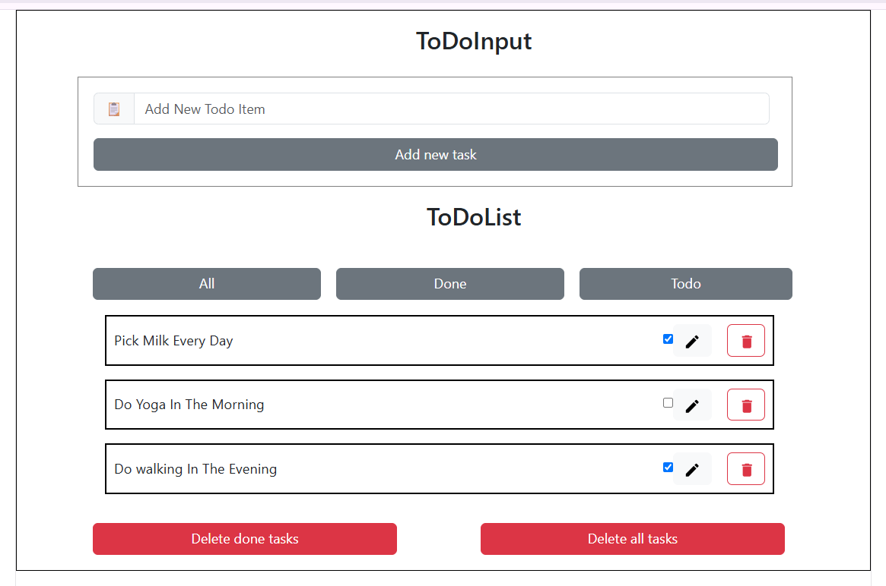

To Do List:-

To Do List Discription:

To Do List Is a React Application It Is used to organize their daily task for remindering us, we can add new task, mark tasks as completed, delete tasks, edit tasks.

Features:

Add a new Task
Mark task as completed
Filter completed and pending tasks
Select Todo task
edit a task
delete done task
delete all tasks

Technologies Used:

React.js
JavaScript (ES6)
HTML5
CSS3
Bootstrap
Material UI

Screenshort:

After Cloning We need to Install this Extensions: BootStrap: npm install bootstrap@5.3.8 Ui Material: npm install @mui/material @mui/styled-engine-sc styled-components

npm install @mui/material @emotion/react @emotion/styled

npm install react-is@18.3.1

npm install @mui/icons-material

Router: npm install react-hook-form

npm install react-router-dom

Author:
Name: Kandukuri Namitha
GitHub: https://github.com/kandukurinamitha-1902

Email: your-kandukurinamitha@gmail.com

License:
This project is created for learning and educational purposes.
